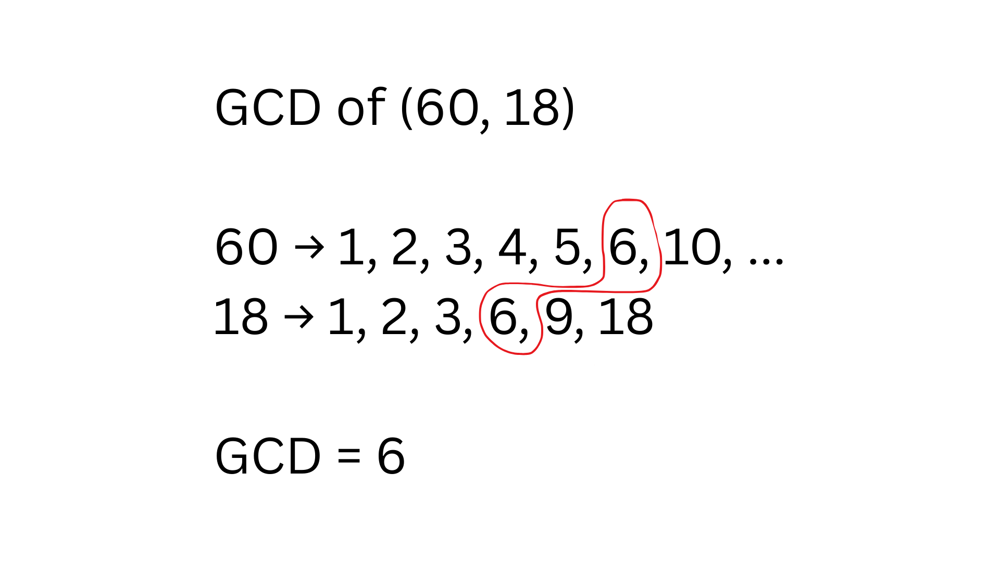
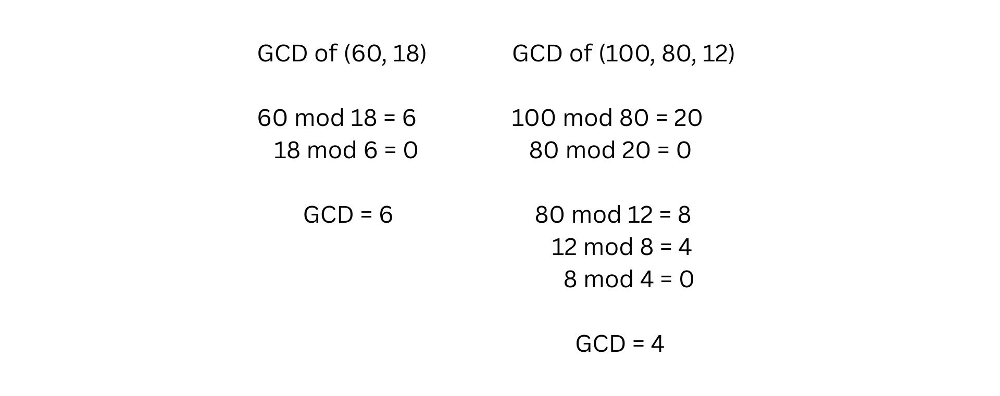

# 📊 GCD Calculator by using Euclidean Algorithm

I implemented the Euclidean Algorithm by using the C++ programming language. That small program was developed by using if-else condition, which helps to easily find the Greatest Common Divisor (GCD) of two numbers.

---

## ✒️ What is GCD ?

The largest integer that divides two or more integers without leaving a remainder is called the GCD. 

The figure below demonstrates how to calculate the GCD manually:

  

 

---

## ⚙️ Algorithm Used

This program uses the **Euclidean Algorithm**, which works as follows:

1. Divide the larger integer by the smaller integer.
2. Replace the larger integer with the smaller integer.
3. Replace the smaller integer  with the remainder.
4. Repeat the process until the remainder becomes 0.
5. The last non-zero remainder is the GCD.

The figure below demonstrates how to calculate the GCD using Euclidean Algorithm:

  

 

---

## 🎮 How to Run ?

1. Download or clone this repository.
2. Open the project folder in Dev C++ (or any C++ IDE).
3. Compile and run the program.
4. Enter two integers to calculate their GCD.

---

 Don't forget to hit the ⭐ if you like this repo. 

